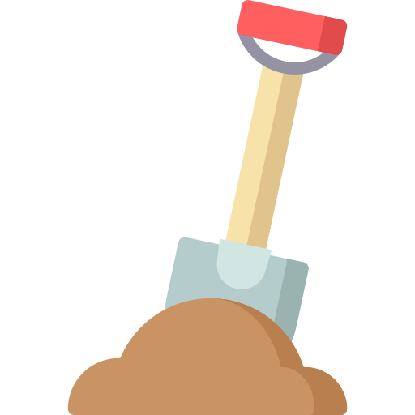

<p align="center">
  <a href="https://github.com/Kibibit/dev-tools" target="blank"></a>
  <h2 align="center">
    @kibibit/dev-tools
  </h2>
</p>
<p align="center">
  <a href="https://www.npmjs.com/package/@kibibit/dev-tools"></a>
</p>
<p align="center">
<a href="https://www.npmjs.com/package/@kibibit/dev-tools"></a>
<a href="https://codecov.io/gh/Kibibit/dev-tools">
  
</a>
<a href="https://github.com/Kibibit/dev-tools/actions/workflows/build.yml">
  
</a>
<a href="https://github.com/Kibibit/dev-tools/actions/workflows/tests.yml">
  
</a>
<a href="https://github.com/semantic-release/semantic-release"></a>
 <!-- ALL-CONTRIBUTORS-BADGE:START - Do not remove or modify this section -->
<a href="#contributors-"></a>
<!-- ALL-CONTRIBUTORS-BADGE:END -->
</p>
<p align="center">
  Scripts to make development easier
</p>
<hr>

## Usage

Install globally
```bash
npm install --global @kibibit/dev-tools
```
or locally
```bash
npm install --save-dev @kibibit/dev-tools
```
Then, go into a git project folder and run
```bash
kb-prune-merged
```
to prune local branches that merged and deleted on cloud

Or use this command in your git hooks to prevent accidental commits to protected branches:
```bash
kb-disallow-master-commits
```
for example, [husky](https://github.com/typicode/husky)

### package.json
```json
/* ... */
"scripts": {
  "disallow-master-commits": "kb-disallow-master-commits"
}
```
Then, add it as a pre-commit git hook:
```bash
npx husky add .husky/pre-commit "npm run disallow-master-commits"
git add .husky/pre-commit
```

<!-- ## Features
- Supports JSON\YAML files\env variables\cli flags as configuration inputs. See `yaml-config` in the examples folder
- Supports shared configuration files (same file shared for multiple projects)
- initialize a configuration file with `--saveToFile` or `--init`
- save configuration files anywhere above your project's package.json
- forced singleton for a single installation (reuse same class)
- testable
- The ability to create json schemas automatically and add descriptions
  to configuration variables
- Get meaningfull errors when configuration is wrong! -->

## Contributors ✨

Thanks goes to these wonderful people ([emoji key](https://allcontributors.org/docs/en/emoji-key)):
<!-- ALL-CONTRIBUTORS-LIST:START - Do not remove or modify this section -->
<!-- prettier-ignore-start -->
<!-- markdownlint-disable -->
<table>
  <tr>
    <td align="center"><a href="http://thatkookooguy.kibibit.io/"><br /><sub><b>Neil Kalman</b></sub></a><br /><a href="https://github.com/Kibibit/dev-tools/commits?author=Thatkookooguy" title="Code">💻</a> <a href="https://github.com/Kibibit/dev-tools/commits?author=Thatkookooguy" title="Documentation">📖</a> <a href="#design-Thatkookooguy" title="Design">🎨</a> <a href="#maintenance-Thatkookooguy" title="Maintenance">🚧</a> <a href="#infra-Thatkookooguy" title="Infrastructure (Hosting, Build-Tools, etc)">🚇</a> <a href="https://github.com/Kibibit/dev-tools/commits?author=Thatkookooguy" title="Tests">⚠️</a></td>
  </tr>
</table>

<!-- markdownlint-restore -->
<!-- prettier-ignore-end -->

<!-- ALL-CONTRIBUTORS-LIST:END -->

This project follows the [all-contributors](https://github.com/all-contributors/all-contributors) specification. Contributions of any kind are welcome!

<div>Logo made by <a href="https://www.flaticon.com/authors/freepik" title="Freepik">Freepik</a> from <a href="https://www.flaticon.com/" title="Flaticon">www.flaticon.com</a></div>
<br>

## Stay in touch

- Author - [Neil Kalman](https://github.com/thatkookooguy)
- Website - [https://github.com/kibibit](https://github.com/kibibit)
- StackOverflow - [thatkookooguy](https://stackoverflow.com/users/1788884/thatkookooguy)
- Twitter - [@thatkookooguy](https://twitter.com/thatkookooguy)
- Twitter - [@kibibit_opensrc](https://twitter.com/kibibit_opensrc)